# Lab Report 1
## step 1: log into a course-specific account on ieng6

[Link ti ieng6](https://sdacs.ucsd.edu/~icc/index.php)
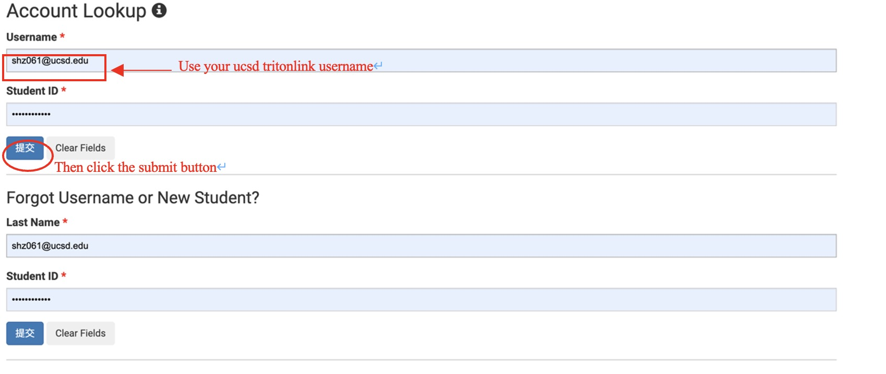
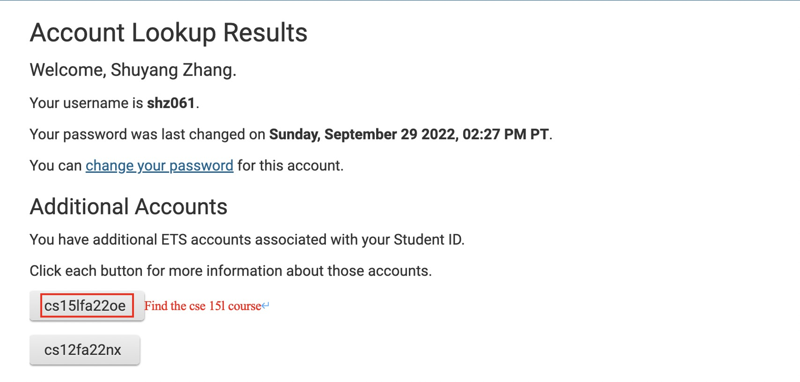

## Step 2: Installing VScode
[Link to download VScode](https://code.visualstudio.com/)
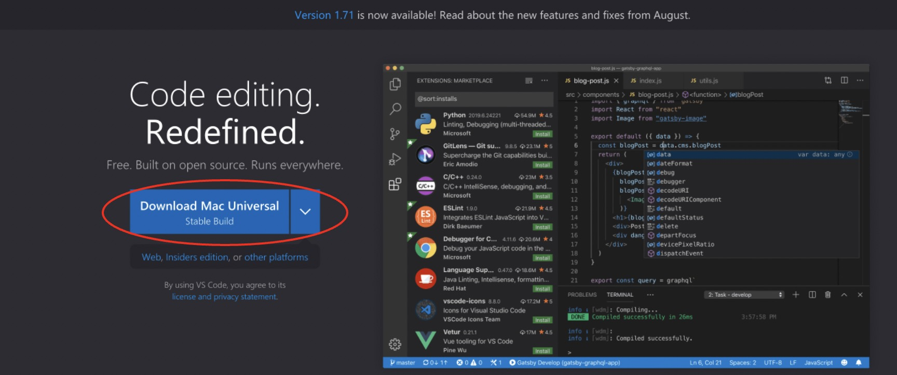
Go to the link above and click the download button.

If you successfully download the VScode, open it, you will see the screen below
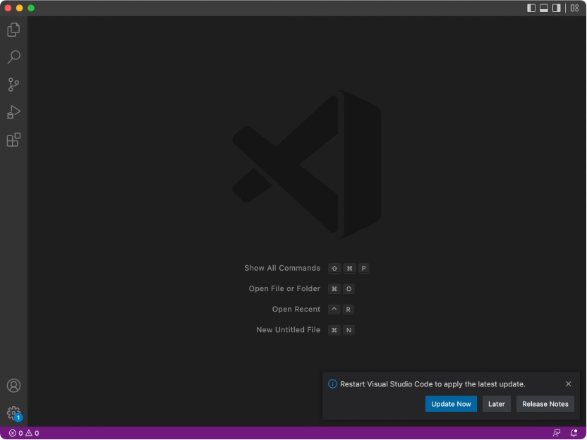

## Step 3: Remotely Connecting
-Open the terminal in the VScode (terminal—new terminal) and enter a command:
`ssh yourusername@ieng6.ucsd.edu`
(yourusername is the 11-character account you see in step 1 start with cs15l22fa.)

-Press enter/return, it will show some sentence:

The authenticity of host 'ieng6-202.ucsd.edu (128.54.70.227)' can't be established.

RSA key fingerprint is SHA256:ksru****YH+sySHnHAtLUHngrPEyZTDl/1x99wUQcec.

Are you sure you want to continue connecting (yes/no/[fingerprint])?

-Enter yes and press enter/return

-Then it will ask you to enter the password.

-When you typing your password, the actual number will not show on the screen.

-After entering your password, you will see many information about your account:
* Your last login time
* a greeting to your account name
* the cluster status
* the present time

You are now on the remote server and you will see something like the below picture:
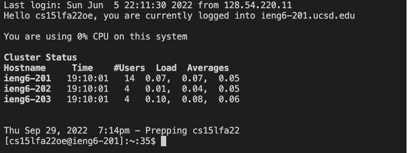

-Now you have successfully connected to the CSE basement, and all commands will run on this computer.

## Step 4: Trying Some Commands
Type some command in the terminal, for example:
```
pwd
ls
ls -lat
ls -a
ls /home/linux/ieng6/cs15lfa22/other’s_username
cp /home/linux/ieng6/cs15lfa22/public/hello.txt ~/
cat /home/linux/ieng6/cs15lfa22/public/hello.txt
```
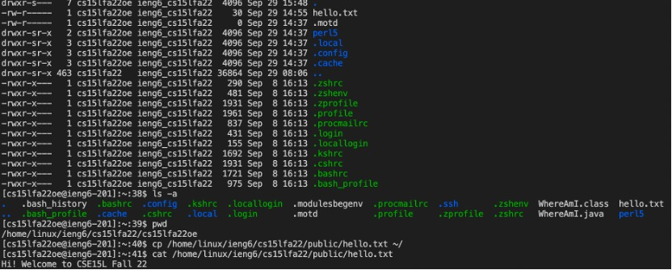
You may see something like the picture above.

## Step 5: Moving Files with scp
First log out the account you current using by:
- Ctrl + D
- Type exit in the terminal
Create a file call WhereAmI.java on your own computer:

```
class WhereAmI 
{
  	public static void main(String[] args) 
	{
    		System.out.println(System.getProperty("os.name"));
    		System.out.println(System.getProperty("user.name"));
    		System.out.println(System.getProperty("user.home"));
    		System.out.println(System.getProperty("user.dir"));
  	}
}
```

Using javac and java command to compile and run the file:

	javac WhereAmI.java
  
  	java WhereAmI

Run the scp command:
> scp command: scp copies files from one computer to another; it stands for "secure copy". It uses the same accounts and logins as ssh, so if you can ssh in a computer, you can copy files to it with scp.

```
scp WhereAmI.java cs15lfa22__@ieng6.ucsd.edu:~/ 
```
(enter your username on the horizontal line.)

Then login to the account again using ssh command, and you need to enter your password

Use ls, you will see the file. Then you can run this file on the server with your course account

(using the javac and java command again)

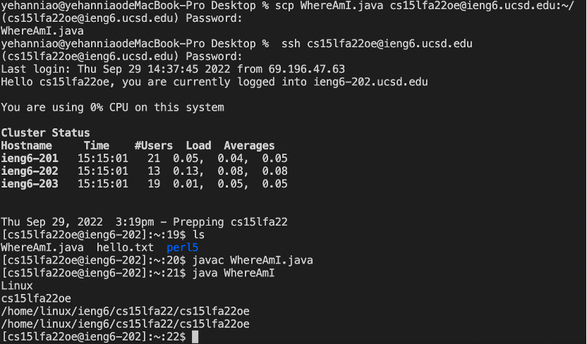

You will get something like the above picture

Before using the scp and ssh command, running the `WhereAmI.java` would show your computer type as the OS name, and your personal private username as the username; and show the directory of the file on your own computer. After, the file is copied into your course account. Then the result of running the `WhereAmI.java` will change: the OS name is Linux and the username becomes your username of the course account. The home and directory shows the path of the file in you course account.

Look at the pictures below to find the difference:

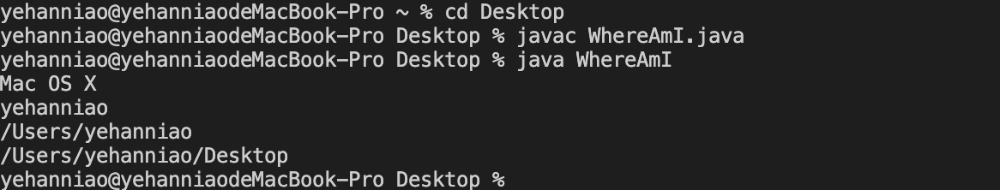 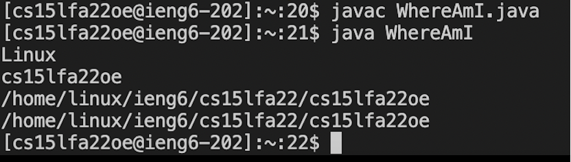

## Step 6: Setting an SSH Key
First log out from the server (Ctrl + D, exit

enter `ssh-keygen`

> The ssh-keygen creates a pair of files called the public key and private key. You copy the public key to a particular location on the server, and the private key in a particular location on the client. Then, the ssh command can use the pair of files in place of your password. This is a common setup step in lots of work environments that involve code on a server.

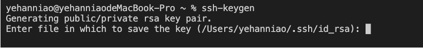

When you see this line, press enter/return to specify the default path and remember the path.

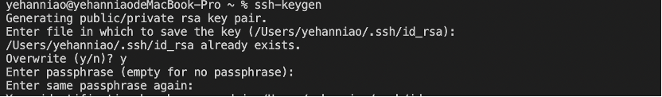

Press enter/return when it gives the prompt `Enter passphrase (empty for no passphrase): `, and press enter/return again when it asks you to `Enter same passphrase again`

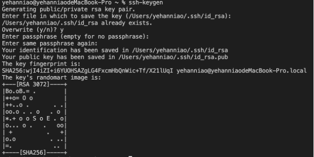

Finally you will see the key image
- Now log in to your account: `ssh cs15lfa22__@ieng6.ucsd.edu` 

(enter your username on the horizontal line)

You will need to enter your password
- type mkdir .ssh in the terminal
- log out your account(Ctrl + D, exit)
- type the following
```
scp the_path_you_get_from_previous_step.pub cs15lfa22__@ieng6.ucsd.edu:~/.ssh/authorized_keys
```
The path_you_get_from_previous_step will be something like: 
```
/Users/private_account_name/.ssh/id_rsa
```
(enter your username on the horizontal line)
- now you can using the scp or ssh command without entering password, which will save a lot of time.
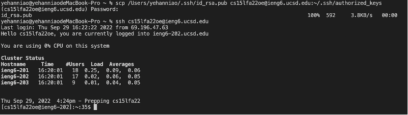

## Step 7: Optimizing Remote Running
- You can use semicolons to connect different commands in the same line
- You can use quotes to quote your command after the ssh and scp commands
- so that the shortcut to copy the file to the server and run it is:
		
		scp WhereAmI.java cs15lfa22oe@ieng6.ucsd.edu:~/; ssh cs15lfa22oe@ieng6.ucsd.edu "javac WhereAmI.java; java WhereAmI"
- after doing this, if you want to make some change in your WhereAmIjava file, you just need to press the upper arrow to update the change on the server.
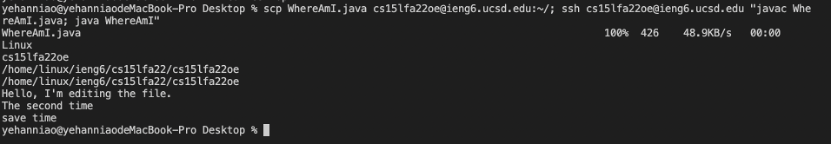


