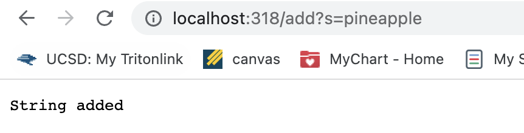
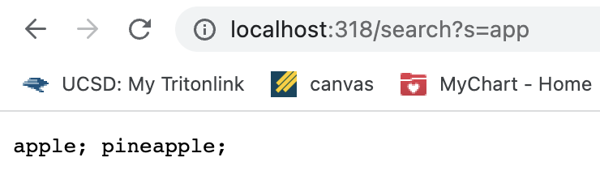
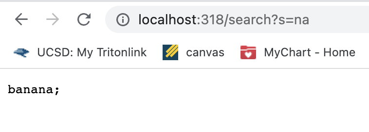
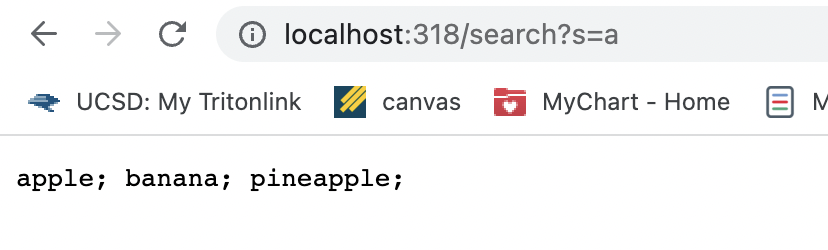
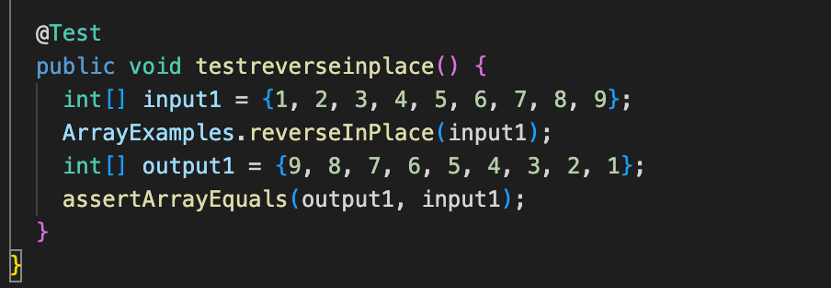
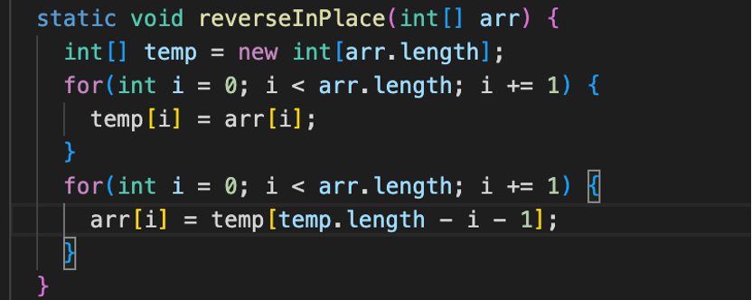
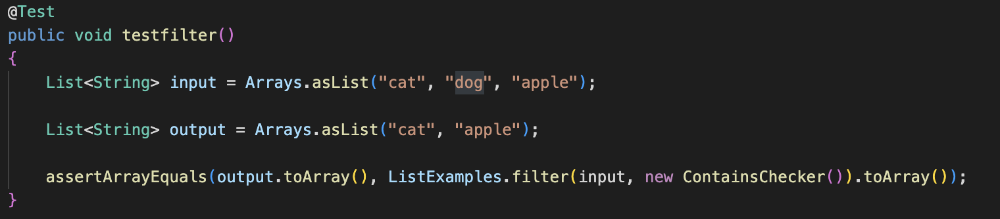
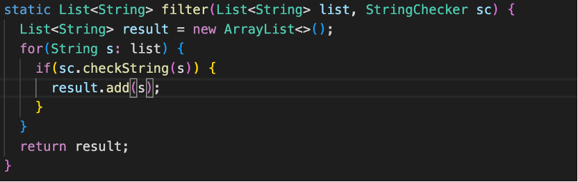

# Lab Report 2
## Part 1
The code for my SearchEngine:
```
import java.io.IOException;
import java.net.URI;
import java.util.ArrayList; 

class Handler implements URLHandler {
    // The one bit of state on the server: a number that will be manipulated by
    // various requests.
    int num = 0;
    ArrayList<String> str = new ArrayList<String>();

    public String handleRequest(URI url) {
        if (url.getPath().equals("/")) {
            return String.format("Number: %d", num);
        } else if (url.getPath().equals("/increment")) {
            num += 1;
            return String.format("Number incremented!");
        } else {
            System.out.println("Path: " + url.getPath());
            if (url.getPath().contains("/add")) {
                String[] parameters = url.getQuery().split("=");
                if (parameters[0].equals("count")) {
                    num += Integer.parseInt(parameters[1]);
                    return String.format("Number increased by %s! It's now %d", parameters[1], num);
                }
                else if (parameters[0].equals("s")) 
                {
                    str.add(parameters[1]);
                    return String.format("String added");
   
                }
            }
            else if (url.getPath().contains("search")) 
                {
                    String strlist = "";
                    String[] parameters = url.getQuery().split("=");
                    if (parameters[0].equals("s"))
                    {
                        for (int i = 0; i < str.size(); i++)
                        {
                        if (str.get(i).contains(parameters[1]))
                        {

                            strlist = strlist + str.get(i) + "; ";
                        }
                        
                        }
                        return strlist;
                        
                    } 
                
                }
            return "404 Not Found!";
        }
    }
}

class SearchEngine {
    public static void main(String[] args) throws IOException {
        if(args.length == 0){
            System.out.println("Missing port number! Try any number between 1024 to 49151");
            return;
        }

        int port = Integer.parseInt(args[0]);

        Server.start(port, new Handler());
    }
}
```
Below are the screenshots of the URL in the browser and the page's response:

add:



This one I call the ```handleRequest(URI url)```method in the code, created a new stringlist str; and under the situation ```url.getPath().contains("/add")```, it satisfied 
```
else if (parameters[0].equals("s")) 
{
    str.add(parameters[1]);
    return String.format("String added");
}

```
so that the word "pineapple" are now in the str list by using the add() method, and the page will tell you that "String added". I added "apple" and "banana".

- Now, the str is ["apple", "banana", "pineapple"].

Query:





-Above are the screenshots of search, with different querys ```s=app; s = na; s = a``` separately. 
-This one is also call the method ```handleRequest(URI url)```, and satisfy the if statemetn: ```else if (url.getPath().contains("search"))```;
```
{
    String strlist = "";
    String[] parameters = url.getQuery().split("=");
    if (parameters[0].equals("s"))
    {
        for (int i = 0; i < str.size(); i++)
        {
            if (str.get(i).contains(parameters[1]))
            {
                strlist = strlist + str.get(i) + "; ";
            }
                        
        }
        return strlist;
                        
    } 
                
}
 ```
It will create a new empty string strlist, and finding out whether the elements in the str stringlist (which are we added previously) contains the string after "=" in the URL(which is the word we search for). Every element contains the searching word will be added to the strlist String with a semicolon, and finally it will dispaly the strlist, which contains all the elements satisfying our searching.

The first image search for "app", so that the strlist is 
- now "apple; pineapple"; 

the second search for "na", only "banana" contains "na" so that the strlist is now 
- "banana; "; 

the third search for "a", which all three words contained, so now the strlist is 
- "apple, banana; pineapple; ".


## Part 2
> The first bug is choosing from the file ArrayExamples.java, in the reverseInPlace method:

- Here is the test I wrote:


- The failure-inducing input is:{1, 2, 3, 4, 5, 6, 7, 8, 9}
- The symptom is {9, 8, 7, 6, 5, 6, 7, 8, 9}
- The bug is: 
```
for (int i = 0; i< arr.length; i++)
{
    arr[i] = arr[arr.length - i - 1];
}
```
- It replace the first-half part of the array with the last-half part, so that when i equals half of the length of the array, ```arr[arr.length - i -1] ```will be the same as ```arr[i] ```as the original array, since the ```arr[arr.length - i -1] ```is already been replaced, so that the last-half of the array will be the same as the last-half of the original array.
- To fix it, I create a new temp array the same as the input, and replace the part arr[arr.length - i -1] with temp[temp.length -i - 1]; since the int in temp were not changed, we can get the expected result.
Below is my fixed code:


> The second bug is choosing from the file ListExamples.java, in the filter method:

- Here is the test I wrote:


- The failure-inducing input is: ["cat", "dog", "apple"];
- The symptom is [“apple”, “cat”];
- The bug is:
```
for(String s: list)
{
    if(sc.checkString(s))
    {
        result.add(0, s);
    }
}
```
- It adds the element at index 0, which will add it at the beginning of the result, so that in reverse order;

- To fix it, I change result.add(0, s) to result.add(s), so that the element will be added at the end of the result, which will be in the expected order.

Below is my fixed code:

