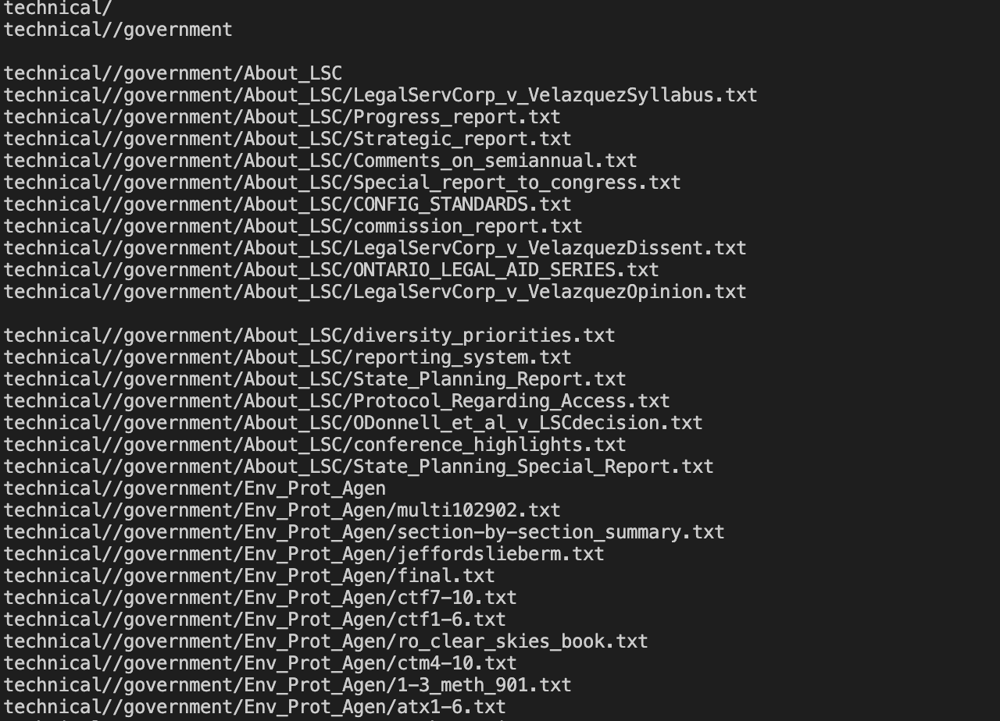

# Lab Report 3
## less
```
less -N find-results.txt
```
```
1 technical/
      2 technical//government
      3 technical//government/About_LSC
      4 technical//government/About_LSC/LegalServCorp_v_VelazquezSyllabus.txt
      5 technical//government/About_LSC/Progress_report.txt
      6 technical//government/About_LSC/Strategic_report.txt
      7 technical//government/About_LSC/Comments_on_semiannual.txt
      8 technical//government/About_LSC/Special_report_to_congress.txt
      9 technical//government/About_LSC/CONFIG_STANDARDS.txt
     10 technical//government/About_LSC/commission_report.txt
     ...
     1396 technical//911report/chapter-6.txt
     1397 technical//911report/chapter-7.txt
     1398 technical//911report/chapter-9.txt
     1399 technical//911report/chapter-8.txt
     1400 technical//911report/preface.txt
     1401 technical//911report/chapter-12.txt
     1402 technical//911report/chapter-10.txt
     1403 technical//911report/chapter-11.txt
(END)
```
- This will show the line number of the current file. so that we can know the line numbers and the correspond contents.

```
less -X find-results.txt
```
```
technical/
technical//government
technical//government/About_LSC
technical//government/About_LSC/LegalServCorp_v_VelazquezSyllabus.txt
technical//government/About_LSC/Progress_report.txt
technical//government/About_LSC/Strategic_report.txt
technical//government/About_LSC/Comments_on_semiannual.txt
technical//government/About_LSC/Special_report_to_congress.txt
technical//government/About_LSC/CONFIG_STANDARDS.txt
technical//government/About_LSC/commission_report.txt
technical//government/About_LSC/LegalServCorp_v_VelazquezDissent.txt
...
technical//government/Gen_Account_Office/GovernmentAuditingStandards_yb2002ed.txt
technical//government/Gen_Account_Office/Sept27-2002_d02966.txt
technical//government/Gen_Account_Office/d01376g.txt
technical//government/Gen_Account_Office/Statements_Feb28-1997_volume.txt
technical//government/Gen_Account_Office/og97019.txt
technical//government/Gen_Account_Office/pe1019.txt
technical//government/Gen_Account_Office/Testimony_Jul15-2002_d02940t.txt
technical//government/Gen_Account_Office/gg96118.txt
```
- This command is similar as ```less filename```, but ```less filename``` will open a new window of the results, this one could leave the resluts in the ternimal.

```
less -s find-results.txt
```
```
technical/
technical//government

technical//government/About_LSC
technical//government/About_LSC/LegalServCorp_v_VelazquezSyllabus.txt
technical//government/About_LSC/Progress_report.txt
technical//government/About_LSC/Strategic_report.txt
technical//government/About_LSC/Comments_on_semiannual.txt
technical//government/About_LSC/Special_report_to_congress.txt
technical//government/About_LSC/CONFIG_STANDARDS.txt
technical//government/About_LSC/commission_report.txt
technical//government/About_LSC/LegalServCorp_v_VelazquezDissent.txt
technical//government/About_LSC/ONTARIO_LEGAL_AID_SERIES.txt
technical//government/About_LSC/LegalServCorp_v_VelazquezOpinion.txt

technical//government/About_LSC/diversity_priorities.txt
...
```
- This command line willmerges consecutive blank lines into a single blank line, so that the blank won't take too much space in the terminal
- inital:

- after:


## find
```
find technical -size -1M
```
```
technical/plos/pmed.0010058.txt
technical/plos/pmed.0010070.txt
technical/plos/pmed.0010064.txt
technical/plos/pmed.0020158.txt
technical/plos/journal.pbio.0020042.txt
technical/plos/journal.pbio.0020297.txt
technical/plos/pmed.0020206.txt
technical/plos/pmed.0020212.txt
technical/plos/pmed.0020216.txt
technical/plos/journal.pbio.0030094.txt
...
technical/911report/chapter-13.3.txt
technical/911report/chapter-3.txt
technical/911report/chapter-2.txt
technical/911report/chapter-1.txt
technical/911report/chapter-5.txt
technical/911report/chapter-6.txt
technical/911report/chapter-7.txt
technical/911report/chapter-9.txt
technical/911report/chapter-8.txt
technical/911report/preface.txt
technical/911report/chapter-12.txt
technical/911report/chapter-10.txt
technical/911report/chapter-11.txt
```
- We can change the -1M to +1M, +2M, -2M.etc, and this command line will locate and print the files in the current directory whoes size is greater smaller than 1M, so that if we want to find a file with specific size, we can use this command line.


```
yehanniao@yehanniaodeMacBook-Pro docsearch-main % find technical -amin -30
```
```
technical
technical/.DS_Store
technical/biomed/1468-6708-3-3.txt
technical/biomed/1468-6708-3-1.txt
```
- we can change the -30 to any numbers, with both - or + sign, it will locate and print the files in the current directory that was asscessed less than(the + sign will be more than) 30 minites ago. It's useful when we want to find which file we have just accessed or has long time not been accessed.

```
yehanniao@yehanniaodeMacBook-Pro docsearch-main % find technical -mtime 0
```
```
technical
technical/.DS_Store
technical/biomed
technical/biomed/1468-6708-3-1.txt
```
- It will search file in the technical directory that were modified in the last twenty-four hours, so that we can use this command to find the file we just modified.

 


## grep
