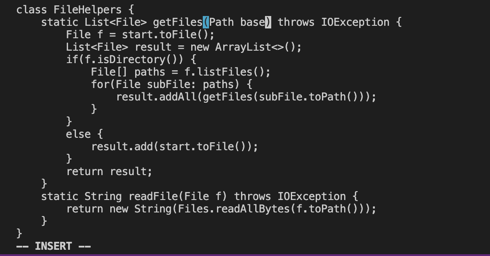
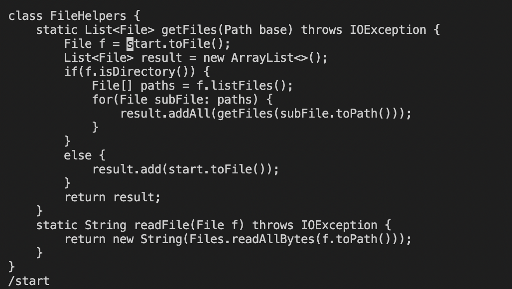
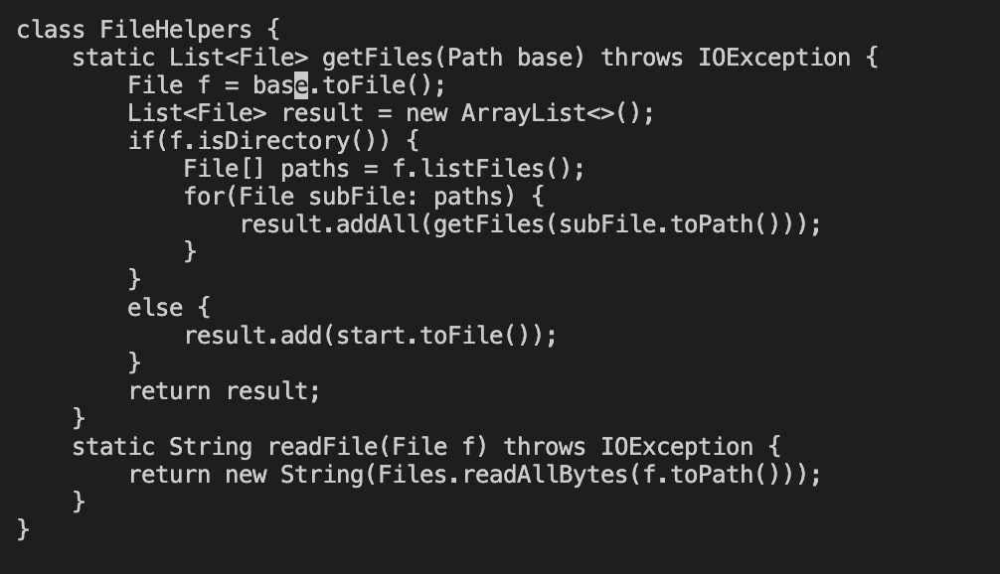
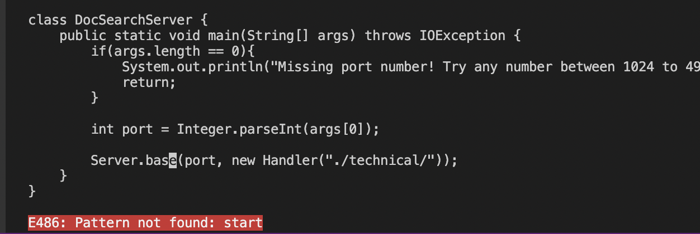

# Lab Report 4
## Part 1

The shortest sequence to change the name of the start parameter and its uses to base:
```
/
start
<enter>
ce
base
<esc>
n
.
n
.
n
.
n
:wq
<enter>
```
- the `/star` command will find the string after it (in my command is start), then press `<enter>`, the cursor will move to the front of the string "start"

- the `ce` command will delete the word start and let you into the INSERT MODE

- enter `base`, then press`<esc>` to escape the insert mode and back to normal mode

- the command `n` will find the next start in the file

- press `.` to repeat last command, which is deleting start and insert base

- repeat the command `n` and `.` until get the notice that there aren't any start in the file

- `:wq<enter>` will save the file and exit vim


## Part 2
- first method tekes me about 90 seconds
- second method takes me about 40 seconds
- Which of these two styles would you prefer using if you had to work on a program that you were running remotely, and why?

   I will prefer the second one. Since the program were running remotely, eidting the file in vim will save the time that I download the file into my own computer and the time I use scp to update my new editing. Also since I do not need to open it locally, I can sace the space in my own computer.
- What about the project or task might factor into your decision one way or another? (If nothing would affect your decision, say so and why!)

  The length of the file may factor into my decision, since file show in vim is just black and white with code format(compare to the colorful words in VSCode), if the file is too long, my eyes will feel tired and confused which line I'm editing. In contrast, files shown in VSCode is more clear that where I am editing and the colorful words will make my eyes less tired.
