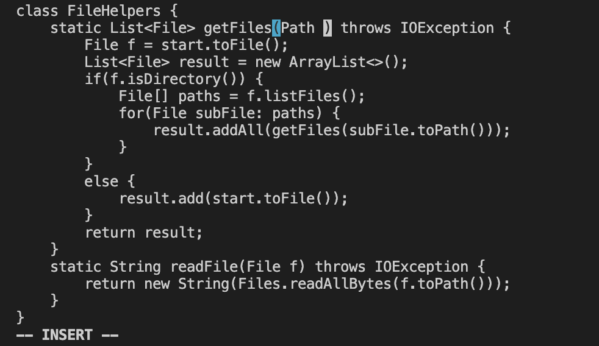

# Lab Report 4
## Part 1

The shortest sequence to change the name of the start parameter and its uses to base:
```
/
start
<enter>
ce
base
<esc>
n
.
n
.
n
.
n
:wq
<enter>
```
- the `/star` command and press <enter> will move the curor to the front of the word start

- the `ce` command will delete the word start and let you into the INSERT MODE

- then enter `base`

