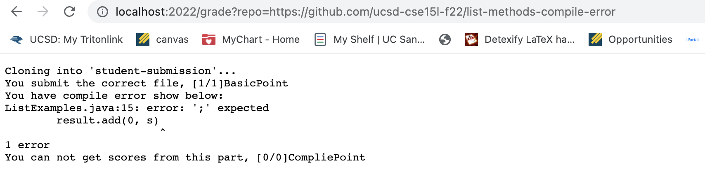
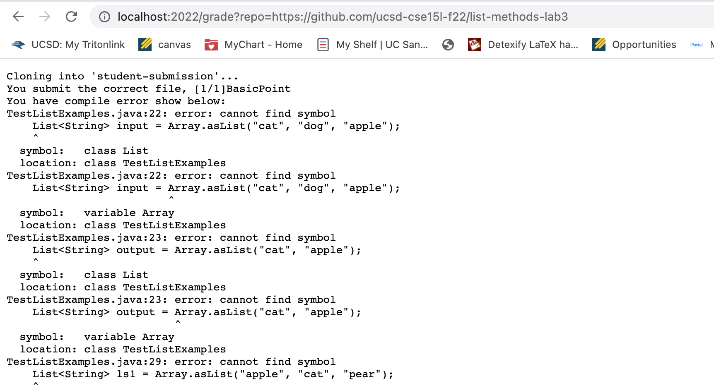
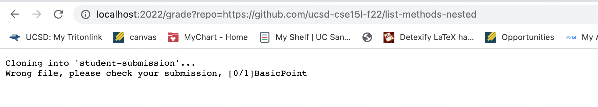

# Lab Report 5
```
# Create your grading script here
# set -e

rm -rf student-submission
git clone $1 student-submission
CPATH=".:../lib/hamcrest-core-1.3.jar:../lib/junit-4.13.2.jar "

cd student-submission


if  [ -e "ListExamples.java" ] 
then
    echo "You submit the correct file, [1/1]BasicPoint"
    
else
    echo "Wrong file, please check your submission, [0/1]BasicPoint"
    exit 1
fi

cd ..
cp TestListExamples.java student-submission/
cd student-submission

javac -cp $CPATH *.java 2> stderr.txt 
if [ $? -ne 0 ] 
then
    echo "You have compile error show below: "
    cat stderr.txt
    echo "You can not get scores from this part, [0/0]CompliePoint"
    exit 1
else
    echo "good job, [1/1]CompliePoint"
    java -cp $CPATH  org.junit.runner.JUnitCore TestListExamples > stdout.txt
    cat stdout.txt
fi
```
-screenshots:



- I choose the first one to describe:
- `rm -rf student-submission` will remove the whole ddirectory student-submission from my previous tries, after command has been performed, the LIST-EXAMPLE-GRADER will not have the student-submission directory; return code 0.
- `git clone $1 student-submission` will clone the link (represented by $1) into a new directory student-submission. After command has been performed, there will be a student-submission appeared in the LIST-EXMPLE-GRADER, and the files from the link(the expected name is ListExamples.java) should be in the student-submission; return code 0;
- `cd student-submission` change the directory to student-submission; return code 0.
- `if  [ -e "ListExamples.java" ] `: check whether the name of the file in the directory is equal to "ListExamples.java", in the example I choose, it is, then it will echo "You submit the correct file, [1/1]BasicPoint", which will print on the screen, the return code is 0.
- `cd ..`: back to the parent directory: LIST-EXAMPLE-GRADER, return code is 0;
- `cp TestListExamples.java student-submission/`: copy the TestListExamples.java into the student-submission directory. TestListExamples.java is the file I wrote to check whether the menthods in ListExamples.java is correct; return code 0;
- `cd student-submission` change the directory to student-submission; return code 0.
- `javac -cp $CPATH *.java 2> stderr.txt`: compile the file and put the output into a new txt file called stderr. The example I choose has compile error, so that the return code would be 1.
- if [ $? -ne 0 ]:to check whether the previous command do not has return code 0. My example's previous command has return code 1, so that it will echo "You have compile error show below: "
-  `cat stderr.txt`: show the content of the stderr.txt, which we store the stderr in, and it will print the error message on the screen; return code 1.
-  `echo "You can not get scores from this part, [0/0]CompliePoint"`: print the message about the point on the screen
-  `exit 1` exit running


